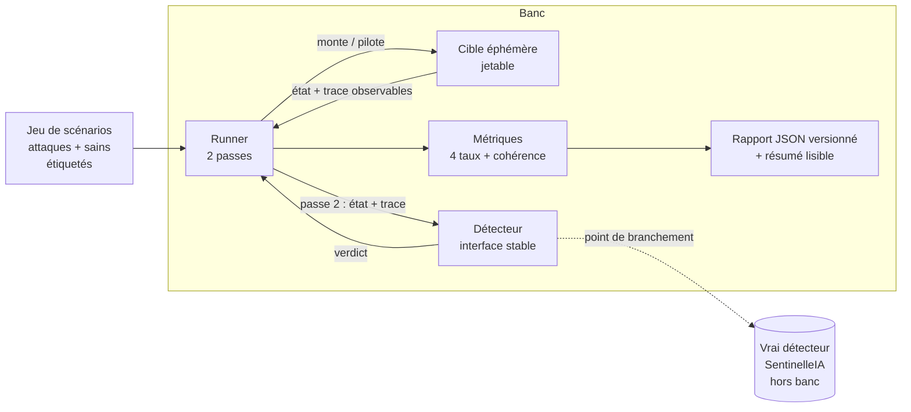
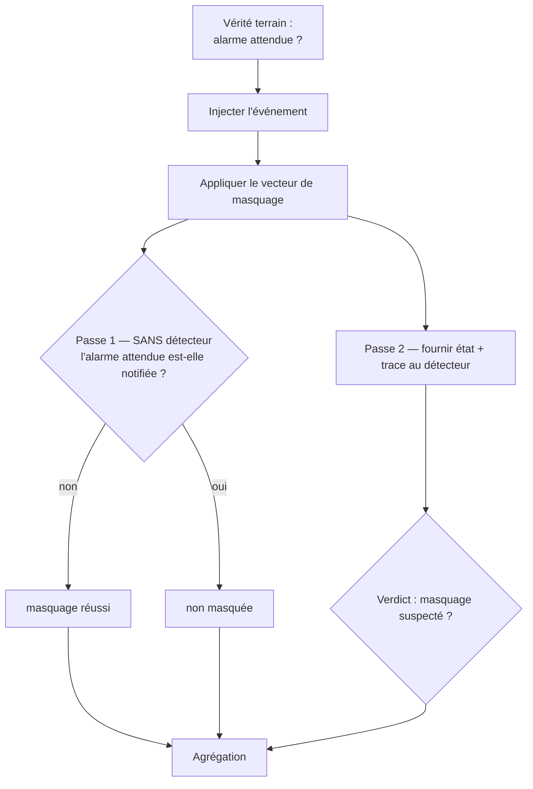

# 02 — Architecture fonctionnelle

## 1. Vue d'ensemble

Sourdine est organisé en **trois composants fonctionnels** pilotés par un runner,
produisant un **rapport**. Le principe central : l'attaque vise l'observateur, donc
chaque scénario est mesuré en **deux passes** (sans détecteur, puis avec).

## 2. Les composants

### 2.1 Cible éphémère (jetable)

Un environnement de supervision que le banc **monte et détruit lui-même**, chargé
d'un jeu de règles d'alerte et d'**inhibition représentatif mais recréé** (jamais
copié de la production). Deux implémentations interchangeables :

- **sim** — modèle en process, déterministe, hermétique (aucun conteneur) ;
- **docker** — vrais Prometheus + Alertmanager en conteneurs isolés, un exporter
  synthétique pilotable et un *sink* webhook qui observe les notifications
  réellement délivrées.

La cible expose une interface unique (monter / exécuter un scénario / détruire) ;
le reste du banc ignore quel backend est utilisé.

### 2.2 Runner (moteur deux passes)

Pour chaque scénario, le runner orchestre la séquence : établir l'état initial,
injecter l'événement qui doit lever l'alarme, appliquer le vecteur de masquage,
**observer l'état des alertes sans détecteur** (passe 1), puis **soumettre l'état
de supervision et la trace au détecteur** (passe 2), et consigner le tout.

### 2.3 Détecteur de masquage

Derrière une **interface stable** (`MaskingDetector`). Il est **aveugle au
scénario** : il ne reçoit que des données de supervision observables (alertes,
silences, historique métrique, trous de collecte), jamais le vecteur ni la vérité
terrain. Le banc fournit une **baseline heuristique** (volontairement imparfaite) ;
le vrai détecteur SentinelleIA se branche au même protocole, hors du banc.

### 2.4 Métriques et rapport

Après la campagne, le banc calcule quatre taux + un contrôle de cohérence,
ventilés par niveau d'accès attaquant, et produit un rapport JSON versionné plus
un résumé lisible.

## 3. La mesure en deux passes

**Le statut de masquage se lit sur la passe 1.** Le verdict de la passe 2 ne change
jamais le statut ; il sert à mesurer le rattrapage, les faux positifs et le résiduel.

## 4. Les quatre taux (sémantique fonctionnelle)

| Taux | Sur quel sous-ensemble | Prouve |
|---|---|---|
| Suppression réussie | attaques, **sans** détecteur | le danger côté client si rien ne protège |
| Rattrapage | attaques **masquées**, avec détecteur | la valeur du produit |
| Faux positifs | scénarios sains, avec détecteur | le coût opérationnel |
| Suppression résiduelle | attaques, avec détecteur | l'honnêteté (ce qui reste masqué) |
| Contrôle de cohérence | cas graves sains | que la cible n'est pas cassée (≈ 100 %) |

La définition formelle est en [doc 05](05-specifications.md#3-définition-des-taux).

## 5. Le catalogue de scénarios (artefact ouvert)

Le jeu de scénarios est **séparé du code** et étiqueté, pour être publié et cité
indépendamment. Chaque scénario porte une **intention** haut-niveau (vecteur,
vérité terrain, hypothèse d'accès attaquant) ; les cibles l'instancient
concrètement. Deux familles : **attaques** (un vecteur) et **sains** (cohérence +
pièges à faux positif).

## 6. Frontières et responsabilités

- Le **détecteur** ne voit que de la supervision observable → il reste substituable
  et évaluable à l'identique, quel que soit le backend.
- La **cible** encapsule toute la sémantique Prometheus/Alertmanager → changer de
  backend ne change ni le runner, ni le détecteur, ni les métriques.
- Le **runner** ne connaît pas les vecteurs un par un → ajouter un vecteur se fait
  dans la cible (+ éventuellement une heuristique dans le détecteur), sans toucher
  l'orchestration.
