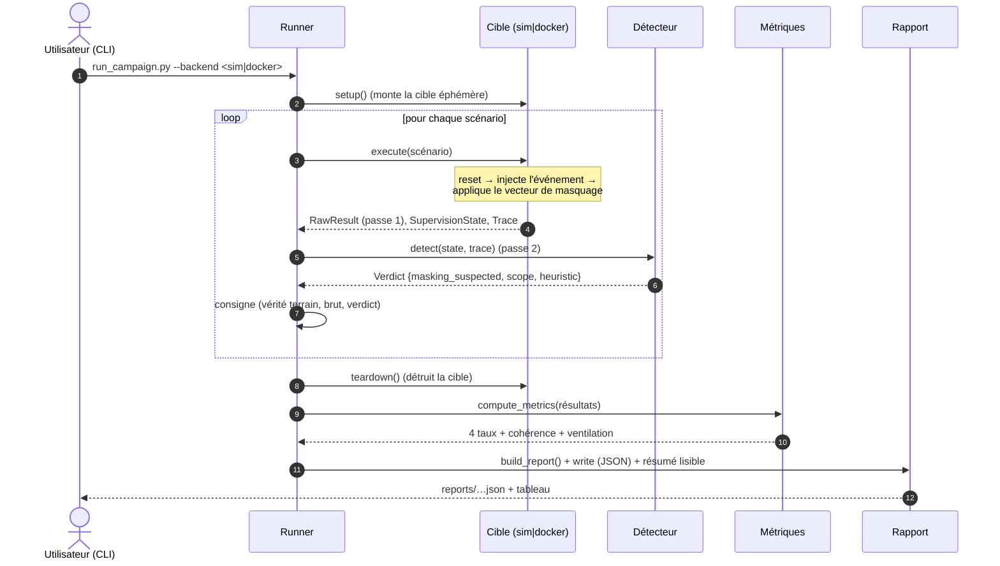
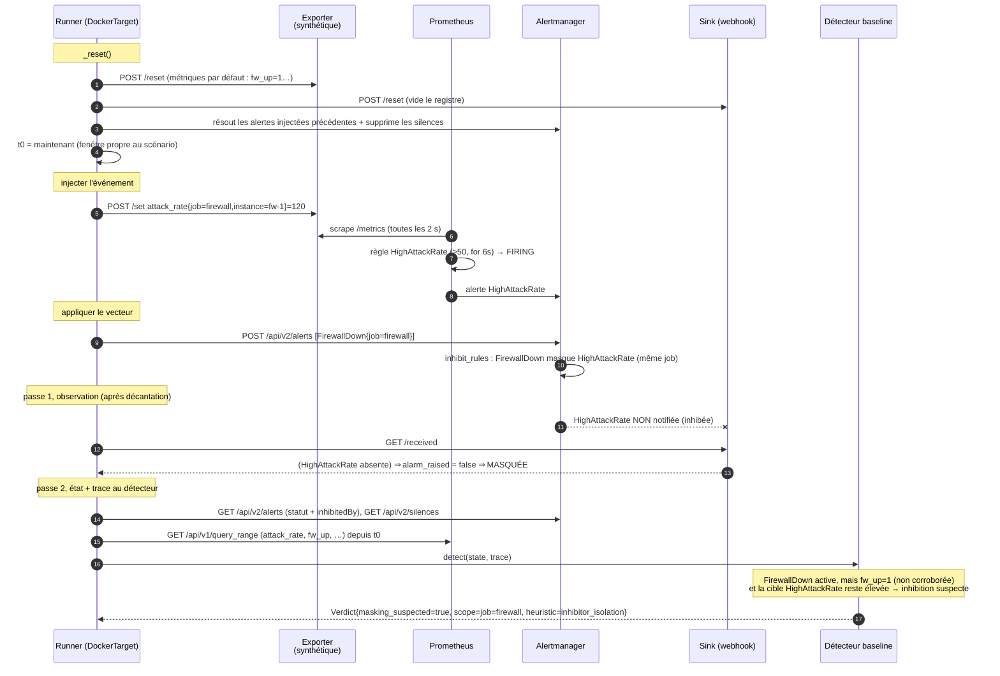
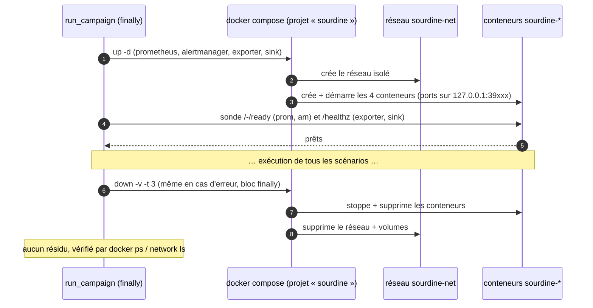
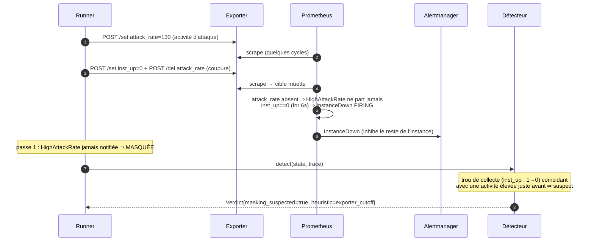

# 03. Diagrammes de séquence

## 1. Campagne complète (tous backends)

## 2. Exécution d'un scénario de spoof (backend docker, bout-en-bout)

Exemple avec `ATT-FW-DOWN-SPOOF-01` : l'attaquant injecte une alerte `FirewallDown`
pour inhiber `HighAttackRate`.

## 3. Cycle de vie de la cible docker (montée / destruction garanties)

## 4. Vecteur de coupure d'exporter (low-and-slow du signal)

Exemple : `ATT-EXPORTER-CUTOFF-08`.

> La sim suit exactement la même logique, sans le réseau ni le temps réel : elle
> calcule l'état final de façon déterministe (cf. [doc 04](04-architecture-technique.md)).
