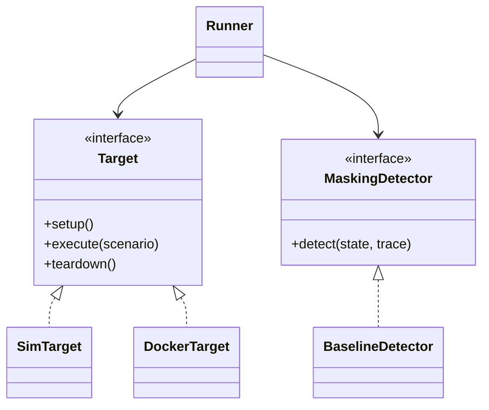

# 04 — Architecture technique

## 1. Stack

| Élément | Choix | Raison |
|---|---|---|
| Langage | Python ≥ 3.10, **bibliothèque standard uniquement** | campagne à blanc sans install réseau ; artefact citable |
| HTTP (backend docker) | `urllib.request` (stdlib) | zéro dépendance |
| Cible docker | `prom/prometheus:v2.48.0`, `prom/alertmanager:v0.26.0` | versions représentatives de la prod |
| Exporter / sink | image `python:3.12-slim` + script bind-monté | aucun build d'image |
| Orchestration | `docker compose` v2 (projet `sourdine`) | montée/destruction jetable |
| Diagrammes | mermaid dans Markdown | versionnable, rendu GitHub |

## 2. Cartographie des modules (`sourdine/engine/`)

| Module | Responsabilité |
|---|---|
| `types.py` | Dataclasses partagées : `Scenario`, `GroundTruth`, `Alert`, `Silence`, `SupervisionState`, `Trace`, `RawResult`, `Verdict`, `ScenarioResult` (+ lectures normatives `masked`/`flagged`) |
| `model.py` | **Sémantique recréée** : règles d'alerte, seuils, `inhibit_rules`, groupement ; fonctions `apply_inhibitions`, `apply_silences`, `silence_matches`, `group_key` |
| `target_base.py` | Interface `Target` (setup / execute / teardown) |
| `target_sim.py` | Cible **sim** : interprète l'intention du scénario → état final déterministe |
| `target_docker.py` | Cible **docker** : pilote de vrais Prometheus/Alertmanager via leurs API |
| `detector.py` | Interface `MaskingDetector` + `BaselineDetector` (16 heuristiques, une par famille de vecteurs) |
| `runner.py` | Moteur deux passes (`run_campaign`) |
| `metrics.py` | Calcul des 4 taux + cohérence + ventilation par accès |
| `report.py` | Rapport JSON versionné + résumé lisible |
| `scenarios.py` | Chargeur du jeu de scénarios (JSON → `Scenario`) |

Point d'entrée : `run_campaign.py` (CLI). Le jeu de scénarios vit sous
`scenarios/` (données), la cible docker sous `target/`.

## 3. Abstraction de cible (patron Strategy)



Le runner, le détecteur et les métriques ignorent le backend : `SimTarget` et
`DockerTarget` produisent les **mêmes types** (`RawResult` / `SupervisionState` /
`Trace`).

## 4. Backend sim (référence déterministe)

`target_sim.py` traduit l'intention haut-niveau du scénario (`event`, `masking`)
en séries métriques et en ensemble d'alertes actives, puis applique la sémantique
Alertmanager de `model.py` :

- **Firing** : `threshold` (valeur > seuil pendant `FOR_TICKS`) et `absence`
  (signal à 0/absent pendant `FOR_TICKS`).
- **Inhibition / silence / groupement** : `apply_inhibitions`, `apply_silences`,
  et marquage « noyé » si la taille du groupe ≥ `FLOOD_MIN`.
- **Notification** : une alerte est notifiée si elle n'est ni inhibée, ni silencée,
  ni noyée. `alarm_raised` = l'alerte attendue est notifiée.

Horizon = 30 « ticks », `FOR_TICKS` = 3, fenêtre d'intégration = 20 ticks. Aucun
temps réel : les taux sont reproductibles.

## 5. Backend docker (fidélité)

### 5.1 Topologie de la cible éphémère

```mermaid
flowchart TB
    subgraph HOST["Hôte — démon Docker utilisateur"]
      subgraph NET["réseau sourdine-net (isolé)"]
        PR["sourdine-prometheus<br/>v2.48.0"]
        AM["sourdine-alertmanager<br/>v0.26.0"]
        EX["sourdine-exporter<br/>(python stdlib)"]
        SK["sourdine-sink<br/>(python stdlib)"]
        PR -->|scrape| EX
        PR -->|alertes| AM
        AM -->|webhook| SK
      end
    end
    RUN["Runner (hôte)"] -.127.0.0.1:39090.-> PR
    RUN -.127.0.0.1:39093.-> AM
    RUN -.127.0.0.1:39080.-> EX
    RUN -.127.0.0.1:39099.-> SK
```

| Conteneur | Port interne | Publication | Rôle |
|---|---|---|---|
| `sourdine-prometheus` | 9090 | `127.0.0.1:39090` | scrape + évaluation des règles |
| `sourdine-alertmanager` | 9093 | `127.0.0.1:39093` | routage + inhibition + silences |
| `sourdine-exporter` | 8000 | `127.0.0.1:39080` | métriques synthétiques pilotables (`/set`, `/del`, `/reset`) |
| `sourdine-sink` | 9099 | `127.0.0.1:39099` | reçoit les notifications (organe d'observation) |

**Tous les ports sont liés à `127.0.0.1`** et sur des numéros hauts (39xxx) : aucune
exposition réseau, aucune collision possible avec un stack de production.

### 5.2 Pilotage et observation

- **Injection d'événement** : `POST /set` sur l'exporter (ex. `attack_rate=120`).
- **Vecteurs** : `POST /api/v2/alerts` (spoof, flood), `POST /api/v2/silences`
  (silence), `/set`+`/del` (low-and-slow, coupure).
- **Observation (passe 1)** : `GET /received` sur le sink → l'alarme attendue
  a-t-elle été **notifiée** (donc non inhibée, non silencée, routée) ?
- **État (passe 2)** : `GET /api/v2/alerts` (statut + `inhibitedBy`, résolu en noms
  via les empreintes), `GET /api/v2/silences`, et `query_range` sur Prometheus pour
  l'historique métrique.

### 5.3 Isolement inter-scénarios

Deux mécanismes garantissent qu'un scénario ne contamine pas le suivant :

1. `_reset()` : remet l'exporter à l'état par défaut, vide le sink, **résout les
   alertes injectées** via l'API AM, supprime les silences.
2. **Fenêtre métrique propre** : `query_range` part de `t0` (début du scénario),
   pas d'un `now-60s` fixe — sinon l'historique TSDB de Prometheus bave d'un
   scénario sur l'autre (bug corrigé en `59c26c61`).

### 5.4 Robustesse des masquages préventifs

Les masquages par **inhibition** (spoofs `*_down_spoof`) et par **silence**
(`silence_*`) sont déterministes par nature, mais leur application par Alertmanager
peut perdre une course de *premier flush* : l'alerte cible est notifiée au sink avant
qu'AM applique le muting, alors même que l'inhibiteur/silence est actif. À charge nulle,
`instance_down_spoof` et le silence à `alertname=~.+` perdaient ~1 exécution sur 3.
Trois leviers les rendent déterministes :

1. **Ordre** : le masquage préventif est posé **avant** l'événement qui fait firer
   l'alerte (et non après), pour être dans le muting index d'AM au firing.
2. **Confirmation + stabilisation** : on attend que l'alerte source / le silence soit
   `active` dans AM (`_await_alert_active` / `_await_silence_active`), puis on stabilise
   au-delà de 2× `group_interval` ; les silences sont postés avec `startsAt` dans le
   passé (activation immédiate). Le matcher regex sur `alertname` est le plus lent à indexer.
3. **Retry** : si l'alerte fuite malgré tout, le scénario est re-tenté (jusqu'à 4 fois) ;
   la course étant rare et ré-indépendante, la fuite résiduelle tombe sous 0,5 %. Les
   vecteurs NON préventifs ne sont jamais re-tentés (leur résultat, dont `false_resolved`
   non masqué en docker, est voulu).

## 6. Sémantique recréée (représentative, jamais copiée de la prod)

Règles d'inhibition modélisées :

| Source | Cible masquée | Labels `equal` |
|---|---|---|
| `InstanceDown` | `.*` (toutes) | `instance` |
| `FirewallDown` | `HighAttackRate`, `CriticalAttacksDetected`, `JailbreakSurge` | `job` |
| `PostgreSQLDown` | `PostgreSQL.*` | `job` |

Seuils : `attack_rate > 50`, `jailbreak_rate > 10`, `pg_conns > 180`,
`critical_attacks > 0` ; intégré `> 540` sur 20 ticks (low-and-slow). Détails et
liste complète des alertes en [doc 05](05-specifications.md).

## 7. Constats de fidélité (sim ≠ docker, attendus et documentés)

1. **Silence `~.*` refusé** par le vrai Alertmanager (« at least one matcher must
   not match the empty string ») — garde-fou anti « tout silencer ». Le vecteur
   utilise donc `~.+` (toute instance non vide, toujours abusivement large).
2. **Noyade par groupement inefficace** contre un `group_wait` court : AM envoie le
   premier lot (avec la vraie alerte) sous quelques secondes. Docker cote ce vecteur
   « non masqué » ; la sim, qui modélise une config à fenêtre longue, le cote masqué.
3. **Blackout sélectif (`selective_metric_drop`) rattrapé en sim, pas en docker** :
   un vrai Prometheus représente une métrique supprimée par une série qui **s'arrête**
   (staleness), pas par des trous `None`. Le détecteur de gap la voit en sim et la rate
   en docker (le masquage, lui, réussit dans les deux cas — d'où le classement
   TIMING_SENSITIVE).
4. **Faux resolved (`false_resolved`, T1562.011) masque en sim, neutralisé en docker** :
   le resolved posté à l'API AM masque en sim (état figé — l'alerte n'est pas recréée),
   mais **ne tient pas** contre un vrai Prometheus, qui ré-affirme l'alerte au cycle
   d'évaluation suivant (`endsAt` futur) : l'alarme ressort (`masked=False`, déterministe).
   Résultat défensif : agir sur l'état d'Alertmanager est vain tant que la règle est active ;
   le masquage n'existe qu'en sim (état non ré-évalué). Vecteur classé TIMING_SENSITIVE.
5. **Rejeu/gel (`stale_replay`, ACSAC 2022) masque dans les deux backends, rattrapage docker
   non garanti** : la métrique figée à un palier bas empêche l'alerte de firer partout
   (masquage déterministe), mais le RATTRAPAGE par `frozen_replay` suppose que le pic de
   franchissement bref a été scrapé (visibilité timing-dépendante) → classé TIMING_SENSITIVE.
6. **Route black-hole (`route_blackhole`, MITRE T1562.006) — AUCUN écart** : le firing porte un
   label de routage qui l'envoie au récepteur trou-noir (baked dans `alertmanager.yml`, actif dès
   le démarrage), donc la notification est avalée **quel que soit le timing**. Masqué ET rattrapé
   (`notification_blackhole`) de façon déterministe dans les deux backends → classé STRONG_MASK,
   pas TIMING_SENSITIVE. Mentionné ici pour l'exhaustivité : contrairement aux cinq précédents,
   sim et docker concordent.
7. **Watchdog suppression (`watchdog_suppression`, MITRE T1562) — AUCUN écart** : le heartbeat
   `watchdog` est mis à 0 (chaîne morte), valeur explicite et non un trou de staleness, donc le
   silence soutenu est visible **de façon identique** en sim et en docker — pas d'écart de
   représentation comme pour `selective_metric_drop` (constat 3). Masqué ET rattrapé (`watchdog_gap`)
   de façon déterministe dans les deux backends → STRONG_MASK.
8. **Bombe de cardinalité (`cardinality_flood`, MITRE Impair Defenses / T1499) — AUCUN écart** :
   `scrape_samples` mis à une valeur explicite très haute + `inst_up`=0 (scrape rejeté, `sample_limit`
   dépassé, `up`=0 « comme si la cible était tombée »). Le pic de cardinalité est ce qui distingue
   cette fausse panne d'une vraie coupure (que `exporter_cutoff` ne voit pas faute d'activité
   d'attaque avant le trou). Masqué ET rattrapé (`cardinality_flood`) de façon déterministe dans les
   deux backends → STRONG_MASK.
9. **Règle d'inhibition rogue (`rogue_inhibitor`, MITRE T1562.001) — AUCUN écart** : masquage
   préventif (comme les spoofs) — la règle rogue (source `RogueMuter` non sanctionnée) est baked dans
   `alertmanager.yml`, la source postée et confirmée active AVANT que l'alerte cible fire (retry
   déterministe). L'inhibition étant préventive, elle masque de façon fiable dans les deux backends ;
   `inhibitor_isolation` ne l'examine pas (source non sanctionnée), seul `rogue_inhibitor` la rattrape
   → STRONG_MASK. Le pendant sain (`benign_maintenance_inhibition`) — source non sanctionnée inhibant
   une alerte OPÉRATIONNELLE — reste non signalé (discriminant de classe).
10. **Panne induite du garde (`guard_outage_cover`, MITRE T1562.001) — AUCUN écart** : c'est le seul
    vecteur qui n'ajoute **rien** à la cible — ni règle, ni label, ni alerte postée. Il coupe `fw_up`, et
    la règle `FirewallDown` (`fw_up == 0`, for: 6s) fire d'elle-même, puis l'inhibition **sanctionnée**
    `FirewallDown → classe sécurité` (equal: `job`) étouffe l'alerte. La chaîne est prise **telle
    qu'elle est** : c'est ce qui en fait un trou réel plutôt qu'un artifice de banc. Masquage préventif
    (panne établie et confirmée active avant le fire, retry déterministe) → masqué ET rattrapé
    (`guard_down_under_threat`) dans les deux backends → STRONG_MASK. Le pendant sain
    (`benign_guard_maintenance`) porte une panne **identique en tout point**, sans menace : il reste non
    signalé, et c'est ce qui prouve que le discriminant est la **concomitance**, pas la panne.

11. **Périmètre d'inhibition élargi (`inhibition_scope_creep`, MITRE T1562.001) — AUCUN écart** :
    la règle privée de son `equal` est baked dans `alertmanager.yml` et reste **inerte** tant
    qu'aucune `InstanceDown` sur l'instance leurre n'existe. Le vrai Alertmanager applique alors
    l'inhibition **globalement**, conformément à l'avertissement de sa propre documentation
    (« if all label names listed in `equal` are missing from both the source and target alerts,
    the inhibition rule will apply! ») : c'est le comportement RÉEL du produit, pas une
    convention du banc. Masquage préventif (panne du leurre établie et confirmée avant le fire)
    → masqué ET rattrapé (`inhibition_scope_creep`) dans les deux backends → STRONG_MASK. Le
    pendant sain (`benign_scoped_inhibition`) porte une inhibition **parfaitement bornée** et
    reste non signalé : il ne se distingue de l'attaque QUE par le périmètre.

12. **Silence pré-positionné (`preloaded_silence`, MITRE T1562.001) — AUCUN écart** : le silence est
    posté via l'API d'Alertmanager et **confirmé actif** avant que l'alerte cible fire (masquage
    préventif, comme les autres suppressions). Rien n'est ajouté à la configuration : c'est un
    silence parfaitement ordinaire, et c'est précisément le point — au moment de sa pose il est
    indiscernable d'une maintenance. Masqué ET rattrapé (`silenced_under_threat`) dans les deux
    backends → STRONG_MASK. Le pendant sain (`benign_maintenance_silence_op`) produit le **même
    effet observable** — une alerte justifiée étouffée par un silence étroit — et n'en diffère que
    par la **classe** de la cible : il reste non signalé.

Ces écarts sont **réels** et précieux : ils ne sont visibles qu'en exécutant la
vraie cible, et justifient l'existence du backend docker à côté de la sim.
