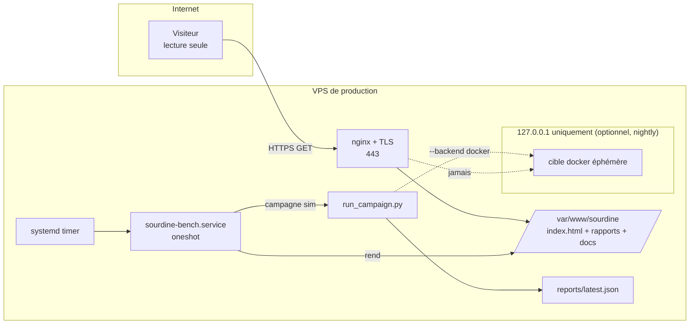

# 08 — Déploiement VPS production (pour les utilisateurs de l'internet)

## 1. Ce qu'on expose, et ce qu'on n'expose pas

Sourdine est un **banc** (outil en ligne de commande), pas une application
multi-utilisateurs. « Déploiement pour les utilisateurs de l'internet » signifie
donc : **publier un site de résultats et de référence en lecture seule** (les
rapports + cette documentation) derrière `sourdine.org` / `sourdine-bench.fr`.

> 🔴 **Règle de sécurité absolue.** La cible du banc (Prometheus + Alertmanager +
> exporter + sink) n'est **jamais** exposée à l'internet. Elle est montée sur
> `127.0.0.1` par le banc, utilisée le temps d'une campagne, puis détruite. Les
> utilisateurs de l'internet ne **lisent** que des résultats statiques ; ils ne
> déclenchent aucune attaque et n'atteignent aucun composant actif.



**Cadence publique recommandée : backend `sim`** (déterministe, sans Docker, aucune
surface d'attaque). Le backend `docker` peut tourner en complément (nightly) sur le
même hôte, toujours en `127.0.0.1`.

## 2. Pré-requis VPS

- Ubuntu 22.04 LTS (ou équivalent), accès `sudo`.
- Les DNS `sourdine.org` et `sourdine-bench.fr` pointant (A/AAAA) vers l'IP du VPS.
- Ports ouverts au public : **443** (et 80 pour le renouvellement ACME) uniquement.

## 3. Durcissement de base

```bash
sudo adduser --system --group --home /opt/sourdine sourdine
sudo apt update && sudo apt install -y python3 git nginx certbot python3-certbot-nginx ufw
# (Docker uniquement si backend docker souhaité)
sudo apt install -y docker.io docker-compose-plugin

sudo ufw default deny incoming
sudo ufw default allow outgoing
sudo ufw allow OpenSSH
sudo ufw allow 'Nginx Full'     # 80 + 443
sudo ufw enable
```

SSH : désactiver l'authentification par mot de passe et le login root
(`/etc/ssh/sshd_config` → `PasswordAuthentication no`, `PermitRootLogin no`).

## 4. Déploiement du banc

```bash
sudo install -d -o sourdine -g sourdine /opt/sourdine /var/www/sourdine
# copier le dossier sourdine/ du dépôt dans /opt/sourdine/app
sudo -u sourdine cp -r /chemin/vers/depot/sourdine /opt/sourdine/app
sudo -u sourdine python3 /opt/sourdine/app/run_campaign.py --backend sim --quiet \
     --out /opt/sourdine/app/reports/latest.json   # test
```

### 4.1 Générateur de site statique

Créer `/opt/sourdine/app/tools/render_site.py` (stdlib uniquement) :

```python
#!/usr/bin/env python3
"""Rend reports/latest.json + la doc en site statique sous /var/www/sourdine."""
import html, json, os, shutil, datetime

APP = os.path.dirname(os.path.dirname(os.path.abspath(__file__)))
WWW = os.environ.get("SOURDINE_WWW", "/var/www/sourdine")
rep = json.load(open(os.path.join(APP, "reports", "latest.json")))
a = rep["aggregate"]

def pct(x): return "n/a" if x is None else f"{x*100:.1f}%"
rows = "".join(
    f"<tr><td>{html.escape(s['id'])}</td><td>{html.escape(s['vector'])}</td>"
    f"<td>{'oui' if s['raw_result']['masked'] else '—'}</td>"
    f"<td>{'oui' if s['detector_verdict']['masking_suspected'] else 'non'}</td></tr>"
    for s in rep["scenarios"])
page = f"""<!doctype html><html lang=fr><meta charset=utf-8>
<meta name=viewport content="width=device-width,initial-scale=1">
<title>Sourdine — résultats</title>
<style>body{{font:16px system-ui;margin:0;background:#0f1115;color:#e6e6e6}}
main{{max-width:900px;margin:auto;padding:24px}}table{{border-collapse:collapse;width:100%}}
td,th{{border:1px solid #333;padding:6px 10px;text-align:left}}a{{color:#6cf}}
.big{{font-size:1.6em;font-weight:700}}</style><main>
<h1>Sourdine — banc de masquage d'alarme</h1>
<p>Format v{html.escape(rep['sourdine_report_version'])} · banc v{html.escape(rep['bench_version'])}
· cible <b>{html.escape(rep['target_backend'])}</b> · détecteur {html.escape(rep['detector'])}
· généré {html.escape(rep['generated_at'])}</p>
<p class=big>Suppression {pct(a['taux_suppression_reussie'])} ·
Rattrapage {pct(a['taux_rattrapage'])} · Faux positifs {pct(a['taux_faux_positifs'])} ·
Résiduel {pct(a['taux_suppression_residuelle'])} · Cohérence {pct(a['controle_coherence'])}</p>
<p><em>Le banc évalue une baseline, pas le produit SentinelleIA.</em></p>
<h2>Scénarios</h2><table><tr><th>id</th><th>vecteur</th><th>masquée</th><th>rattrapée</th></tr>
{rows}</table>
<p><a href="latest.json">rapport JSON</a> · <a href="docs/">documentation</a></p>
<footer><small>MàJ {datetime.datetime.utcnow():%Y-%m-%d %H:%M UTC}</small></footer>
</main></html>"""
os.makedirs(WWW, exist_ok=True)
open(os.path.join(WWW, "index.html"), "w", encoding="utf-8").write(page)
shutil.copy(os.path.join(APP, "reports", "latest.json"), os.path.join(WWW, "latest.json"))
dst = os.path.join(WWW, "docs"); os.makedirs(dst, exist_ok=True)
for f in os.listdir(os.path.join(APP, "docs")):
    if f.endswith(".md"): shutil.copy(os.path.join(APP, "docs", f), os.path.join(dst, f))
print("site rendu dans", WWW)
```

## 5. Automatisation (systemd)

`/etc/systemd/system/sourdine-bench.service` :

```ini
[Unit]
Description=Sourdine — campagne + rendu du site
After=network-online.target

[Service]
Type=oneshot
User=sourdine
Group=sourdine
WorkingDirectory=/opt/sourdine/app
Environment=SOURDINE_WWW=/var/www/sourdine
ExecStart=/usr/bin/python3 run_campaign.py --backend sim --quiet --out reports/latest.json
ExecStartPost=/usr/bin/python3 tools/render_site.py
# Durcissement
NoNewPrivileges=true
ProtectSystem=strict
ReadWritePaths=/opt/sourdine/app/reports /var/www/sourdine
PrivateTmp=true
```

`/etc/systemd/system/sourdine-bench.timer` :

```ini
[Unit]
Description=Cadence Sourdine (quotidienne)

[Timer]
OnCalendar=*-*-* 03:00:00
Persistent=true

[Install]
WantedBy=timers.target
```

```bash
sudo systemctl daemon-reload
sudo systemctl enable --now sourdine-bench.timer
sudo systemctl start sourdine-bench.service   # premier rendu immédiat
```

## 6. nginx + TLS

`/etc/nginx/sites-available/sourdine` :

```nginx
server {
    listen 80;
    server_name sourdine.org www.sourdine.org sourdine-bench.fr;
    root /var/www/sourdine;
    location / { try_files $uri $uri/ =404; }
    # autoindex pour parcourir docs/ et les rapports
    location /docs/ { autoindex on; }
}
```

```bash
sudo ln -s /etc/nginx/sites-available/sourdine /etc/nginx/sites-enabled/
sudo nginx -t && sudo systemctl reload nginx
sudo certbot --nginx -d sourdine.org -d www.sourdine.org -d sourdine-bench.fr
```

certbot bascule le vhost en HTTPS (443) et installe le renouvellement automatique.
En-têtes de sécurité conseillés (bloc `server` TLS) :

```nginx
add_header X-Content-Type-Options nosniff;
add_header X-Frame-Options DENY;
add_header Referrer-Policy no-referrer;
add_header Content-Security-Policy "default-src 'self'; style-src 'self' 'unsafe-inline'";
```

## 7. Backend docker sur le VPS (optionnel, nightly)

Si l'on veut publier aussi des résultats « fidélité » :

- ajouter l'utilisateur `sourdine` au groupe `docker` (⚠️ équivaut à un accès root ;
  n'activer que si nécessaire, VPS dédié) ;
- un second `.service`/`.timer` lançant `--backend docker --out reports/latest-docker.json`
  puis un rendu dédié ;
- la cible docker reste sur `127.0.0.1:39xxx` (vérifié par `ss -ltnp`), jamais
  publiée ; `ufw` n'ouvre que 80/443.

## 8. Vérification

```bash
curl -sI https://sourdine.org/ | head -1                 # 200
curl -s  https://sourdine.org/latest.json | head         # rapport servi
ss -ltnp | grep -E '39090|39093|39080|39099' || echo "cible non exposée : OK"
sudo ufw status                                          # 80/443/SSH seulement
```

## 9. Exploitation

- **Logs** : `journalctl -u sourdine-bench.service`.
- **Mise à jour du banc** : remplacer `/opt/sourdine/app`, relancer
  `systemctl start sourdine-bench.service`.
- **Rollback** : conserver l'`index.html` et `latest.json` précédents ; en cas de
  campagne dégradée (cohérence < 100 %), ne pas écraser le dernier bon rendu
  (ajouter un garde dans le service : n'appeler `render_site.py` que si
  `controle_coherence == 1.0`).
- **Sauvegarde** : versionner les rapports publiés (horodatés) pour la citabilité.

## 10. Checklist sécurité (avant ouverture au public)

- [ ] `ufw` n'autorise que SSH + 80 + 443.
- [ ] Aucun port `39xxx` en écoute sur autre chose que `127.0.0.1`.
- [ ] Le site ne sert que des fichiers **statiques** (HTML/JSON/MD), aucun exécutable.
- [ ] TLS valide (certbot) + en-têtes de sécurité.
- [ ] Aucun secret dans `/var/www` ni dans le dépôt déployé.
- [ ] La page rappelle que le banc évalue une **baseline**, pas le produit.
- [ ] Publication Zenodo/HAL et licences : traitées **en amont** côté CEO (hors banc).
